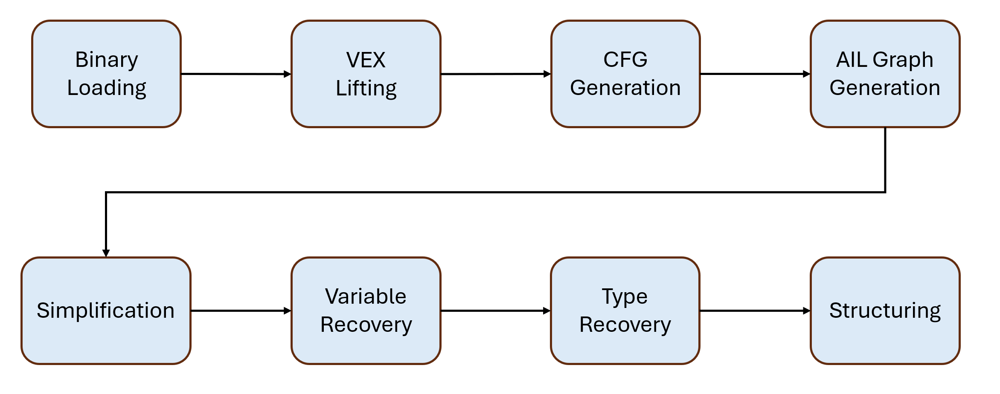

VariableRecovery is an important component in decompilation pipeline. In this blog, we will dive into the implementation of VariableRecoveryFast in angr.

<!-- more -->

## The Basics
### Decompilation Pipeline
Let's take a look at the simplified decompilation pipeline of angr. Given a binary, angr first loads it properly according to its format (e.g., ELF, PE, or even Intel Hex), gaining some necessary information for decompilation, such as segmentation information. For code segment, the Instruction Set Architecture (ISA) is identified by angr to lift the platform-dependent assembly code to platform-independent VEX IR. Based on VEX IR, a control flow graph is recovered by CFG Generation algorithms. The recovered CFG is program-wide and then be converted to a set of function-wide CFGs, and at the same time, VEX IR is converted to a higher-level IR - angr Intermediate Language (AIL), for future decompilation. Each AIL graph will be handled with a sequence of simplification passes. Then Variable Recovery comes into play, traversing each AIL statement and expression in the function and assigning variables and type constraints to them. Based on the variables recovered and type constraints collected by Variable Recovery, Type Recovery then infers and assigns a type for each variable by solving type constraints. Eventually, AIL graph will be structured into a sequence of high-level program structures (e.g., for loop, if-else) and structured pseudo-code is outputed to decompiler users.


### Forward Analysis
Forward analysis is a program analysis term, which is also heavily used in angr. Say you want to traverse a control flow graph from the entry block, how would you do that? You would probably use a Broad First Search (BFS) strategy, starting with the entry block, then adding its successors into the queue, getting a new block from the queue and repeating the process. Forward analysis is a similar but more sophisticated strategy, where a block can be put into the queue multiple times until it reaches a limitation of iterations or all of its predecessors don't produce anything new in current iteration.

## High-level Idea
In the decompilation pipeline, the entry point of Variable Recovery is the [_recover_and_link_variables](https://github.com/angr/angr/blob/af87b435ffbe897d5b3a2147263963c869103590/angr/analyses/decompiler/clinic.py#L1108) in `Clinic.py`. This function calls VariableRecoveryFast analysis and Typehoon analysis, for variable recovery and type inference respectively. The results of Variable Recovery are SSA variables and the statements/expressions that they are bound to.
> In compiler design, static single assignment form (often abbreviated as SSA form or simply SSA) is a property of an intermediate representation (IR) that requires each variable to be assigned exactly once and defined before it is used.

In the context of Variable Recovery, SSA means each variable is only bound to one statement/expression, even though different SSA variables could be the same variable in reality (like two stack variables with the same base and offset are actually the same variable). At the end of `_recover_and_link_variables`, SSA variables will be unified, which means different SSA variables that are actually the same will be able to mapped to one unified variable. That being said, SSA variables will still be bound to every statement/expression.

However, as we all know, C/C++ is not a SSA programming language, so we need to map the SSA variables into the unified variables at some point. In angr, during [Structured Code Generation](https://github.com/angr/angr/blob/69f5da7f6b45bb27f3ff69c299871f8cf79b140f/angr/analyses/decompiler/structured_codegen/c.py), the SSA variable bound to each AIL statement will be used to get the corresponding unified variable, and only the unified variable will be used to generate pseudo-code. That's why only unified variables are used in the final outputed pseudo-code.
```python
def _variable(self, variable: SimVariable, fallback_type_size: Optional[int]) -> CVariable:
    unified = self._variable_kb.variables[self._func.addr].unified_variable(variable)
    ...
    cvar = CVariable(variable, unified_variable=unified, variable_type=variable_type, codegen=self)
```

## Dive Into the Engine
Basically, VariableRecoveryFast traverses all the blocks in a function, for each block, the statements in the block are handled by [SimEngineVRAIL](https://github.com/angr/angr/blob/69f5da7f6b45bb27f3ff69c299871f8cf79b140f/angr/analyses/variable_recovery/engine_ail.py#L26) sequentially. Each statement will be handled by different handler function in the engine based on the statement type. 

### _ail_handle_assignment
An assignment statement is define as below:
$$
dst = src\\
\text{ (dst should be Register or Tmp, src could be any expression)}
$$
